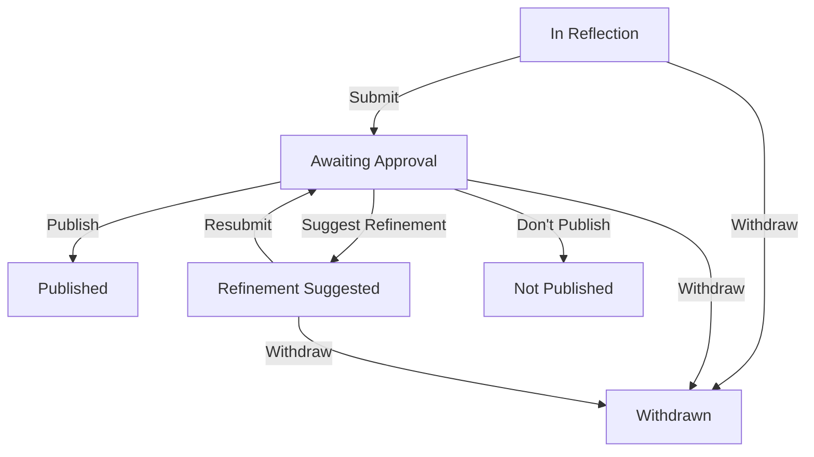

# Experience Review Flow (Flow of Maturation)

This document describes the lifecycle of an "Experience" within the platform.
The terminology is designed to be collaborative and human-centric, focusing on a
**Flow of Maturation** rather than a strict "Moderation" process.

## Status Overview

| Technical State     | User-Facing Label        | Description                                                                                                        |
| :------------------ | :----------------------- | :----------------------------------------------------------------------------------------------------------------- |
| **Pending** (Draft) | **In Reflection**        | The user is currently writing and reflecting on their experience. It is only visible to the author.                |
| **Submitted**       | **Awaiting Approval**    | The user has shared the experience with the group, and it is now waiting for a maturation review by a manager.     |
| **Adjustments**     | **Refinement Suggested** | A manager has reviewed the experience and suggested minor refinements or clarifications before publication.        |
| **Published**       | **Published**            | The experience has been approved and is now visible to the entire group.                                           |
| **Rejected**        | **Not Published**        | The experience was reviewed and it was decided not to publish it in its current form (closed without adjustments). |
| **Deleted**         | **Withdrawn**            | The author chose to withdraw the experience from the group.                                                        |

## The Maturation Philosophy

> "Isso cria um fluxo de maturação, não de moderação."

The goal of this process is to help users' experiences reach their full
potential for the community. Instead of "approving" or "rejecting" content like
a gatekeeper, the managers act as mentors, suggesting **refinements** to ensure
the shared content is coherent, respectful, and impactful.

### Key Terminology Refinements

- **Refinement Suggested** instead of _Changes Requested_.
- **Suggest Refinement** instead of _Request Changes_.
- **Not Published** instead of _Rejected_.
- **Don't Publish** instead of _Reject_.
- **Withdrawn** instead of _Deleted_.

## Flow Diagram

